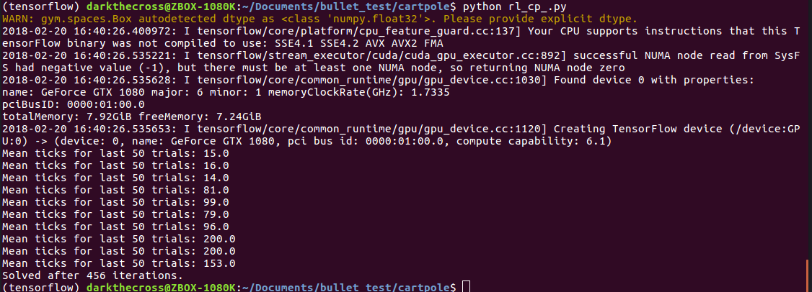
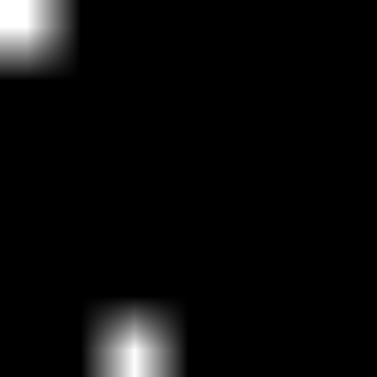
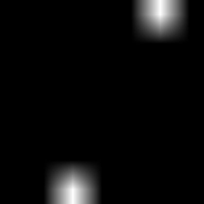

# This is my experiments on deep reinforcement learning

The environment is cartpole-v0 from the [OpenAI Gym](https://gym.openai.com/envs/CartPole-v0/).

I'm using python 3.5, tensorflow-gpu. OpenAI gym is also required to reproduce the result.

In rl_cp_.py, the Q-network takes observation and action as input, and the output is the Q value for the state-action pair.

In rl_cp.py, the Q-network takes observation as the input, while the outputs stands for the Q value for the two actions at this state.

rl_cp_.py is more stable because of better hyper parameters.

Besides, I also implemented an Apple Picker game (Simplified) and used deep Q learning to implement an AI for the game. You
 can see the performance of the AI during the first 300 iterations and last 300 iterations below.

First 300 iterations

Last 300 iterations (Solved!)
